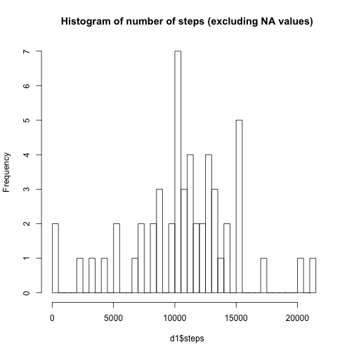
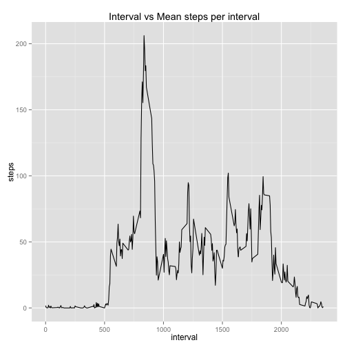
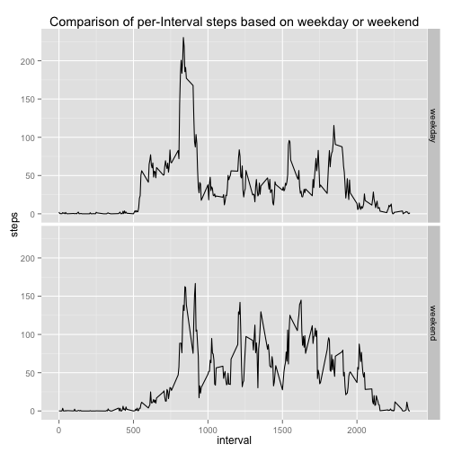

This assignment makes use of data from a personal activity monitoring
device. This device collects data at 5 minute intervals through out the
day. The data consists of two months of data from an anonymous
individual collected during the months of October and November, 2012
and include the number of steps taken in 5 minute intervals each day.

## Loading and preprocessing the data


```r
library(data.table)
if (!("activity.csv" %in% list.files())) {
  unzip("activity.zip")
}
f <- data.table(read.csv("activity.csv"))
head(f,1)
```

```
##    steps       date interval
## 1:    NA 2012-10-01        0
```

## What is mean total number of steps taken per day?

For this part of the assignment, you can ignore the missing values in the dataset.

### Calculate the total number of steps taken per day
Here, we'll calculate a day-by-day number of steps and plot that as a barchart so we understand what that data looks like.

```r
library(reshape2)
library(ggplot2)
m1 <- melt(subset(f,select=c("steps","date")),id="date")
d1 <- dcast(m1, date ~ variable, sum, drop=TRUE)
head(d1)
```

```
##         date steps
## 1 2012-10-01    NA
## 2 2012-10-02   126
## 3 2012-10-03 11352
## 4 2012-10-04 12116
## 5 2012-10-05 13294
## 6 2012-10-06 15420
```

```r
barplot(d1$steps,names.arg=d1$date,main="Barchart of daily total steps")
```

 

### Make a histogram of the total number of steps taken each day
We'll take that same result (day-by-day number of steps) and plot that as a histogram

```r
hist(d1$steps,60,xlim=c(0,22000),main="Histogram of number of steps (excluding NA values)")
```

 

### Calculate and report the mean and median of the total number of steps taken per day
Finally, we see some summary statistics over that data.


```r
mean(d1$steps,na.rm=TRUE)
```

```
## [1] 10766.19
```

```r
median(d1$steps,na.rm=TRUE)
```

```
## [1] 10765
```
## What is the average daily activity pattern?

### Time Series plot
Make a time series plot (i.e. type = "l") of the 5-minute interval (x-axis) and the average number of steps taken, averaged across all days (y-axis)

```r
m2 <- melt(subset(f,select=c("steps","interval")),id="interval",na.rm=TRUE)
d2 <- dcast(m2, interval ~ variable, mean)
ggplot(d2,aes(interval,steps))+geom_line()+ggtitle("Interval vs Mean steps per interval")
```

 

### Where's the maximum interval?
Which 5-minute interval, on average across all the days in the dataset, contains the maximum number of steps?

```r
d2[d2$steps==max(d2$steps),]
```

```
##     interval    steps
## 104      835 206.1698
```

## Imputing missing values

Note that there are a number of days/intervals where there are missing values (coded as NA). The presence of missing days may introduce bias into some calculations or summaries of the data. Here we'll impute<sup>*</sup> values for the missing data.

### How many missing values?
Calculate and report the total number of missing values in the dataset (i.e. the total number of rows with NAs)

```r
sum(is.na(f$steps))
```

```
## [1] 2304
```
### Fill in those values for a new *imputed* dataset
Devise a strategy for filling in all of the missing values in the dataset. The strategy does not need to be sophisticated. For example, you could use the mean/median for that day, or the mean for that 5-minute interval, etc.

Create a new dataset that is equal to the original dataset but with the missing data filled in.


```r
# Replace each with the [arithmetic] mean of the value of the interval as the corresponding value.
f_imputed <- f
head(f_imputed[interval==0])
```

```
##    steps       date interval
## 1:    NA 2012-10-01        0
## 2:     0 2012-10-02        0
## 3:     0 2012-10-03        0
## 4:    47 2012-10-04        0
## 5:     0 2012-10-05        0
## 6:     0 2012-10-06        0
```

```r
# Add the mean for each interval to the table; this just makes replacing the NAs a wee bit easier
f_imputed$means <- d2$steps
# Replace the NAs with the mean for the interval
f_imputed$steps[is.na(f_imputed$steps)] <- f_imputed$mean[is.na(f_imputed$steps)]
head(f_imputed[interval==0])
```

```
##        steps       date interval    means
## 1:  1.716981 2012-10-01        0 1.716981
## 2:  0.000000 2012-10-02        0 1.716981
## 3:  0.000000 2012-10-03        0 1.716981
## 4: 47.000000 2012-10-04        0 1.716981
## 5:  0.000000 2012-10-05        0 1.716981
## 6:  0.000000 2012-10-06        0 1.716981
```

```r
# Drop the helper column
f_imputed[,means:=NULL]
```

```
##            steps       date interval
##     1: 1.7169811 2012-10-01        0
##     2: 0.3396226 2012-10-01        5
##     3: 0.1320755 2012-10-01       10
##     4: 0.1509434 2012-10-01       15
##     5: 0.0754717 2012-10-01       20
##    ---                              
## 17564: 4.6981132 2012-11-30     2335
## 17565: 3.3018868 2012-11-30     2340
## 17566: 0.6415094 2012-11-30     2345
## 17567: 0.2264151 2012-11-30     2350
## 17568: 1.0754717 2012-11-30     2355
```

### Histogram, Mean, and Median of the Imputed Data

Make a histogram of the total number of steps taken each day and Calculate and report the mean and median total number of steps taken per day. 


```r
m_imp <- melt(subset(f_imputed,select=c("steps","date")),id="date")
d_imp <- dcast(m_imp, date ~ variable, sum, drop=TRUE)
hist(d_imp$steps,60,xlim=c(0,22000),main="Histogram of number of steps (with imputed values)")
```

 

```r
mean(d_imp$steps)
```

```
## [1] 10766.19
```

```r
median(d_imp$steps)
```

```
## [1] 10766.19
```

#### Do these values differ from the estimates from the first part of the assignment? 
<dl>
<dt><strong>Histogram</strong></dt>
<dd>The histogram <strong>did</strong> change; this can be explained by the number of elements with no data changing to 0, and those elements moved to other places in the chart (specifically, they moved to the mean point). The result in the chart is that the first bucket decreased and those elements moved to the mean element bar and shifted that bar upwards.</dd>

<dt><strong>Mean</strong></dt>
<dd>The mean <strong>did NOT</strong> change; this was a little surprising, but it is easily explained by the fact that the NA elements only appeared for full days. If we look at the mean of the intervals, we should expect that those mean values do NOT change with the current imputing method.</dd>

<dt><strong>Median</strong></dt>
<dd>The median <strong>did</strong> change; this was less surprising, as adding values into the mix will shift the balance around in the distribution.</dd>
</dl>
## Are there differences in activity patterns between weekdays and weekends?

For this part the `weekdays()` function may be of some help here. Use the dataset with the filled-in missing values for this part.

### Weekday vs Weekend dataset construction
Create a new factor variable in the dataset with two levels – “weekday” and “weekend” indicating whether a given date is a weekday or weekend day.

```r
f_dow <- f_imputed
f_dow$dayKind <- factor(weekdays(as.Date(f_dow$date)) %in% c("Monday","Tuesday","Wednesday","Thursday","Friday"),levels=c(TRUE,FALSE),labels=c("weekday","weekend"))
head(f_dow)
```

```
##        steps       date interval dayKind
## 1: 1.7169811 2012-10-01        0 weekday
## 2: 0.3396226 2012-10-01        5 weekday
## 3: 0.1320755 2012-10-01       10 weekday
## 4: 0.1509434 2012-10-01       15 weekday
## 5: 0.0754717 2012-10-01       20 weekday
## 6: 2.0943396 2012-10-01       25 weekday
```

### Plot that data!
Make a panel plot containing a time series plot (i.e. type = "l") of the 5-minute interval (x-axis) and the average number of steps taken, averaged across all weekday days or weekend days (y-axis). See the README file in the GitHub repository to see an example of what this plot should look like using simulated data.

```r
m_dow <- melt(f_dow,id.vars=c("interval","dayKind"),measure.vars="steps")
d_dow <- dcast(m_dow, interval + dayKind ~ variable, mean)
ggplot(d_dow,aes(x=interval, y=steps, group=dayKind))+
  geom_line()+
  facet_grid(dayKind~.)+
  ggtitle("Comparison of per-Interval steps based on weekday or weekend")
```

 

## *Supplemental Material*
### <sup>*</sup>Impute? What's that?

Above we "imputed" a value. The topic of imputed values is slightly tricky, and imputing values in an inappropriate way can have signficant impacts on the result of an analysis. Complicating the matter is that R wants things to occur in certain ways. This section contains some discussion regarding the topic and its interaction with R.

#### What do we mean by imputing

Missing values disturb a data analyss because they are discontinuities. It would be convenient if we could replaces those holes with values that didn't disturb the analyses but also removed the discontinuity. 

Imputing values is a way of patching these discontinuities in a way where it only minimally disturbs the analyses. To impute is to "assign (a value) to something by inference from the value of the products or processes to which it contributes"[<sup>1</sup>][1] 

One way of setting holes to values such that they disturb an analysis less is to replace holes by an aggregation value function we're performing. For example, replacing a hole with the mean of a set does not alter the mean when it is calculated over the new set.

#### Mechanics of imputing in R

One reference I found to be helpful (it was called out in the [discussion forum](https://class.coursera.org/repdata-034/forum/thread?thread_id=59)) for the mechanics of this replacement is given [here](http://www.mail-archive.com/r-help@r-project.org/msg58289.html). For reference, this is the code that enables a mechanical replacement
```r
impute <- function(x, fun) {
  missing <- is.na(x)
  replace(x, missing, fun(x[!missing]))
}
```

The function `impute()` can be used with `ddply()` to replace the NAs with the result of a function applied to a data set with the NA's removed, such as:

```r
library(plyr)
ddply(df, ~ group, transform, traits = impute(traits, mean))
ddply(df, ~ group, transform, traits = impute(traits, median))
ddply(df, ~ group, transform, traits = impute(traits, min))
```

*[**Comment to reviewers:** Above I use the generic markdown "format an R program" instead of the knitr-flavored "format and run an R program" for the above since these are comments only. I use the more familiar format of this course (the one with the `{r}` to have `knitr` evaluate the R code) elsewhere in this document. --rtc]*

#### Impact on data loading
For `impute()` to work as intended, the data frame should retain it's NA values. That implies that when the data frame is loaded (e.g., via `read.csv()`), the NA values should not be removed (i.e., `na.rm=FALSE`). Care should be taken in this area, as it may not be the norm.

[1]: http://www.oxfordreference.com/view/10.1093/acref/9780195392883.001.0001/acref-9780195392883 "New Oxford American Dictionary
Copyright © 2010, 2013 by Oxford University Press, Inc. All rights reserved."
